# System Design

Diagrams below reflect what each handler actually does, including downstream calls to `ygo-service` (gRPC), the `Suggestion DB` (MongoDB), and the local IP DB file.

## Endpoints (v1)

### `GET /api/v1/suggestions/status`

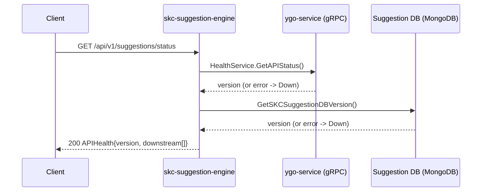

### `POST /api/v1/suggestions/card-details`

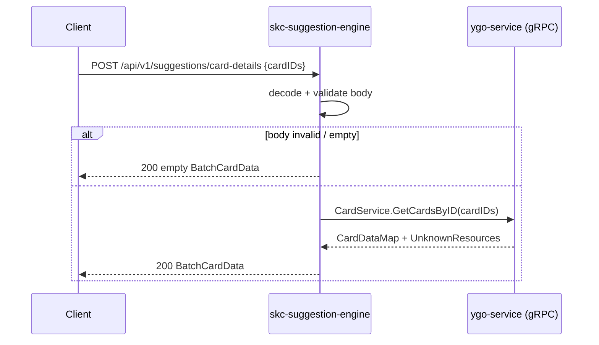

### `GET /api/v1/suggestions/card-of-the-day`

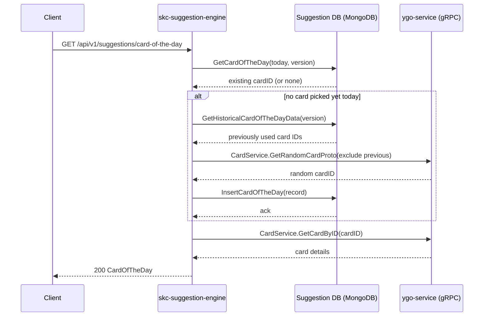

### `GET /api/v1/suggestions/card/{cardID}`

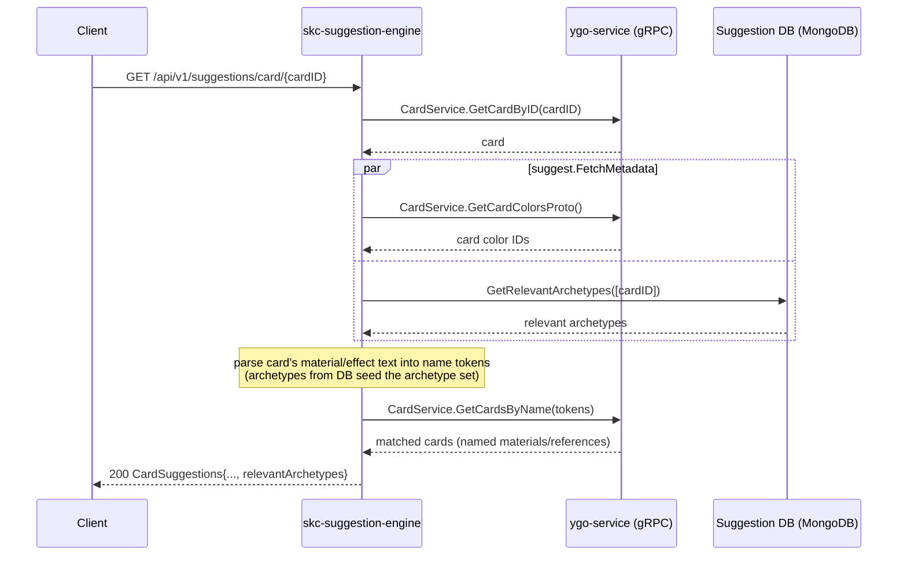

### `POST /api/v1/suggestions/card`

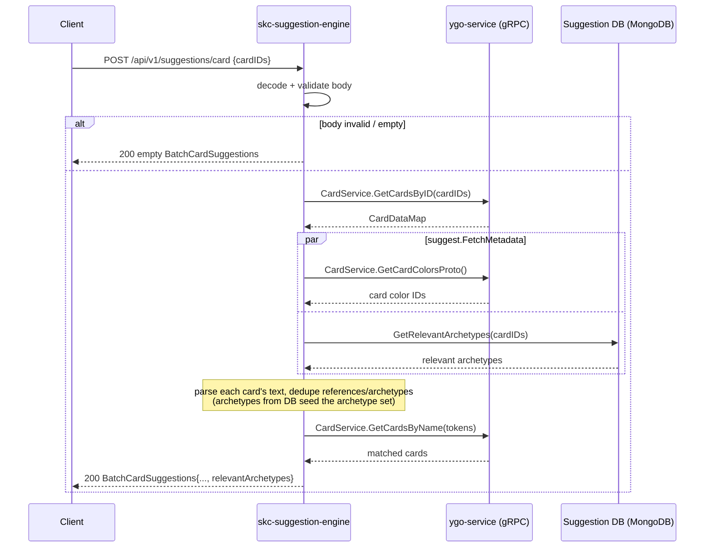

### `GET /api/v1/suggestions/card/support/{cardID}`

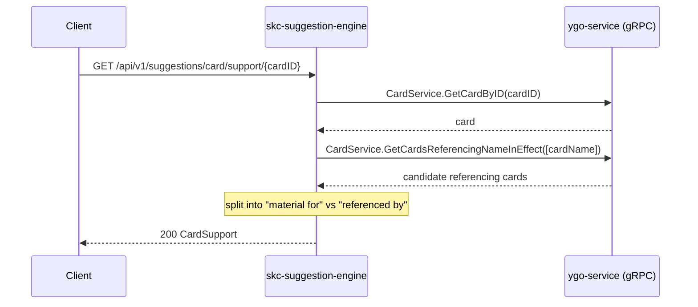

### `POST /api/v1/suggestions/card/support`

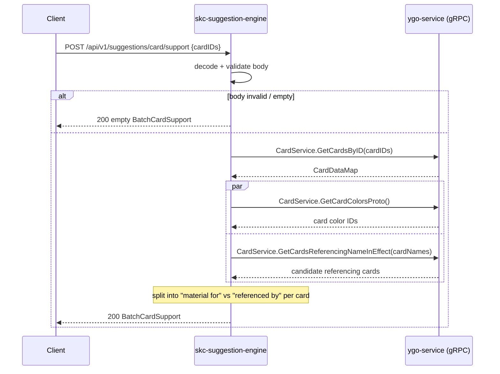

### `GET /api/v1/suggestions/card/{cardID}/similar`

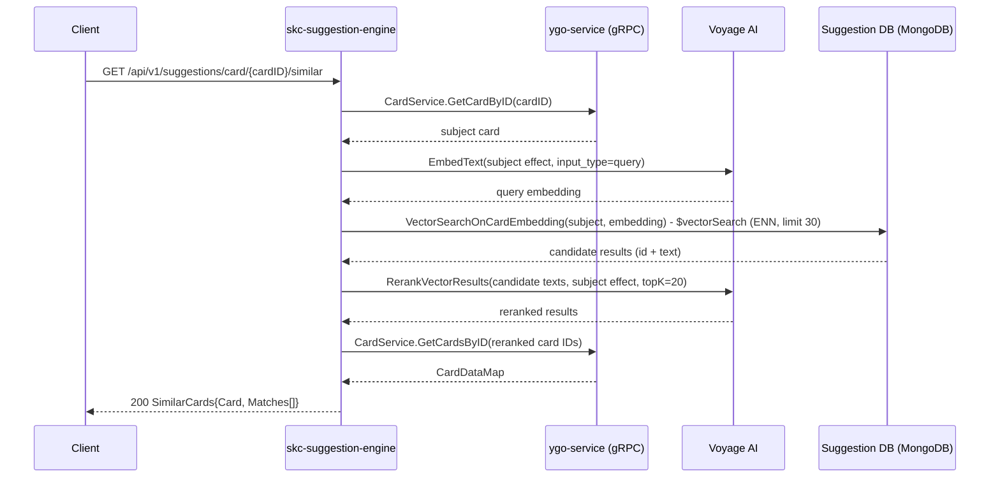

### `GET /api/v1/suggestions/product/{productID}`

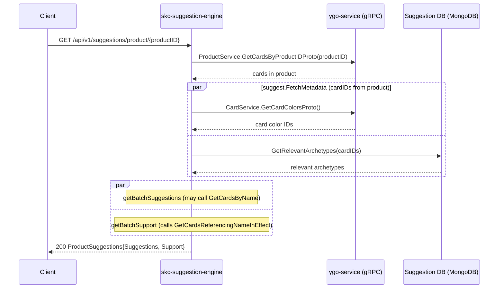

### `GET /api/v1/suggestions/archetype/{archetypeName}`

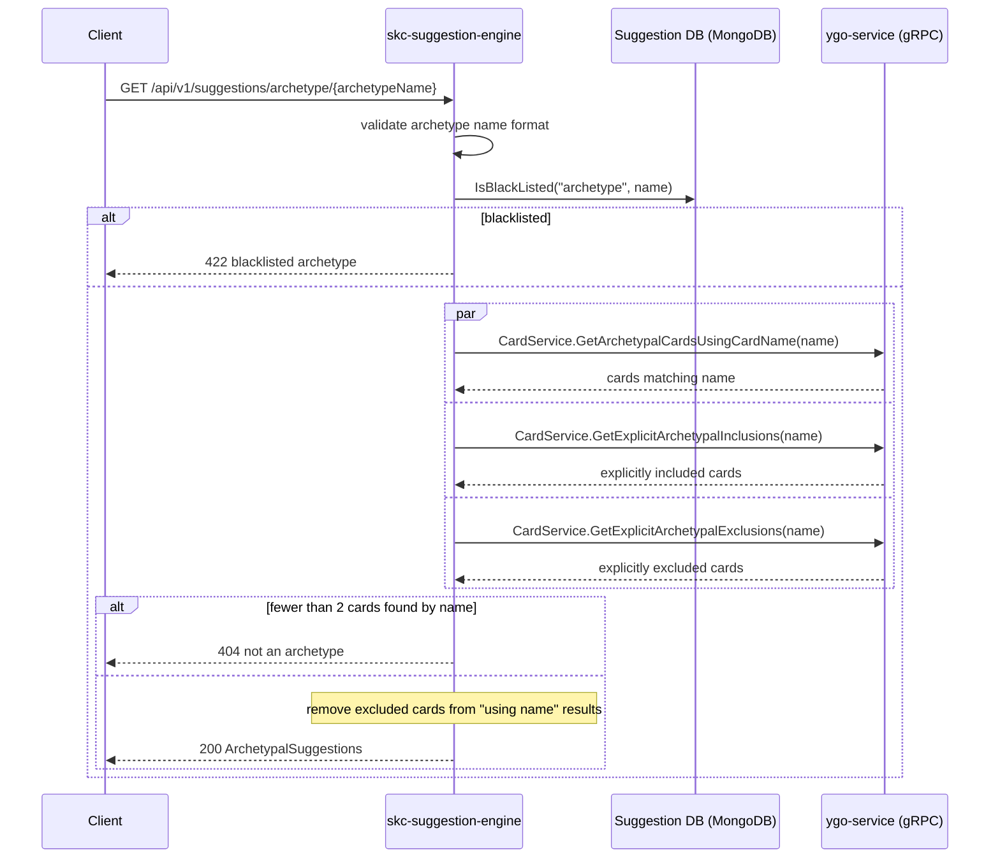

### `GET /api/v1/suggestions/trending/{resource}`

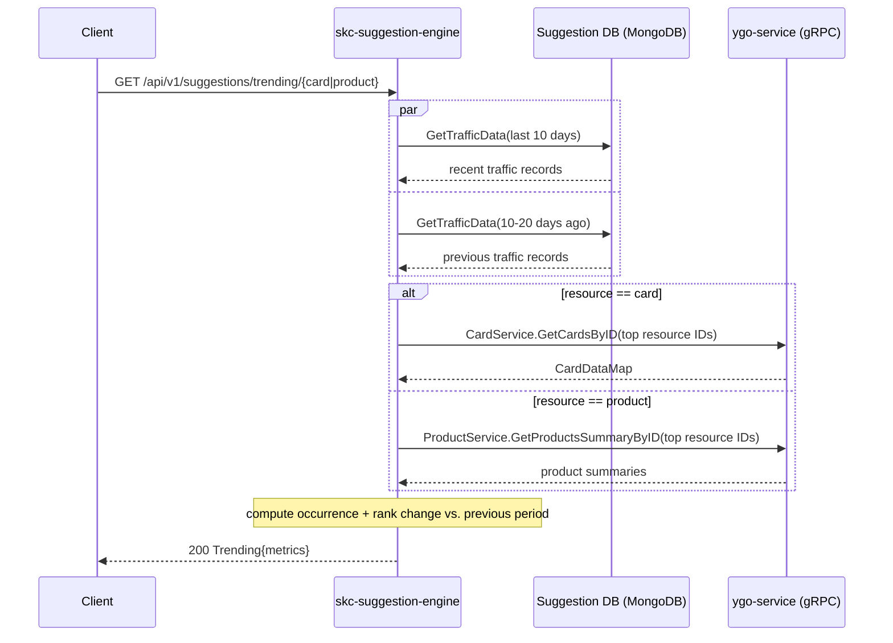

### `POST /api/v1/suggestions/traffic-analysis` 🔒 (requires `API-Key` header)

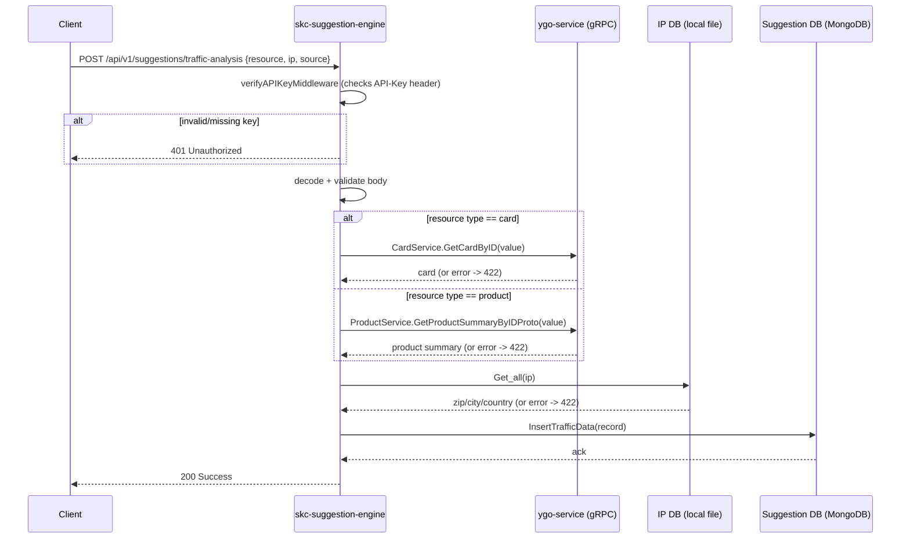

## Endpoints (v2)

### `GET /api/v2/suggestions/archetype/{archetypeName}`

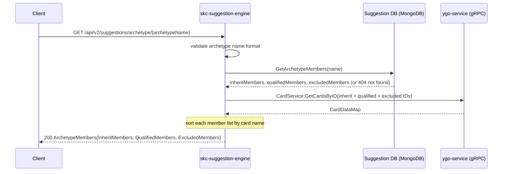

Unlike the v1 `/archetype/{archetypeName}` endpoint (which derives membership by scanning card names/text via `ygo-service` and has no explicit-exclusion source of truth beyond that scan), v2 reads a curated membership document straight from the Suggestion DB (`inheritMembers`, `qualifiedMembers`, `excludedMembers` fields) and hydrates it with card data.
