# System Design

Diagrams below reflect what each handler actually does, including downstream calls to `ygo-service` (gRPC), the `Suggestion DB` (MongoDB), and the local IP DB file.

## Endpoints

### `GET /api/v1/suggestions/status`

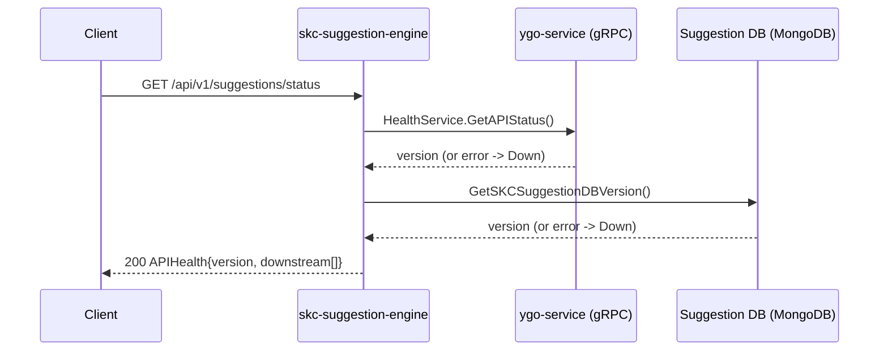

### `POST /api/v1/suggestions/card-details`

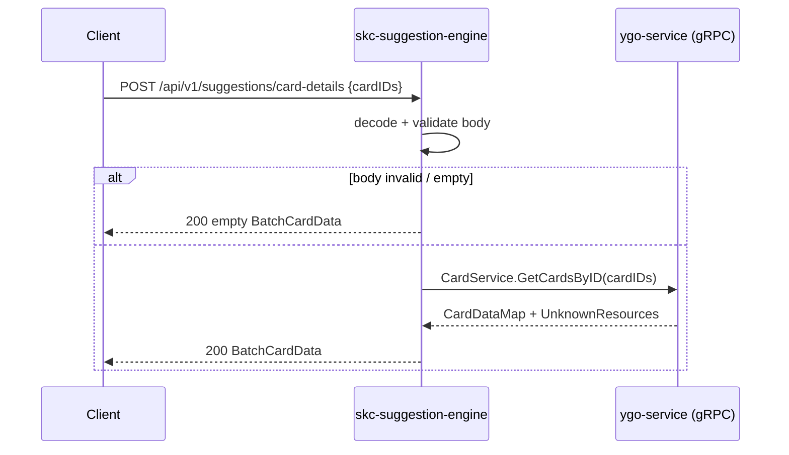

### `GET /api/v1/suggestions/card-of-the-day`

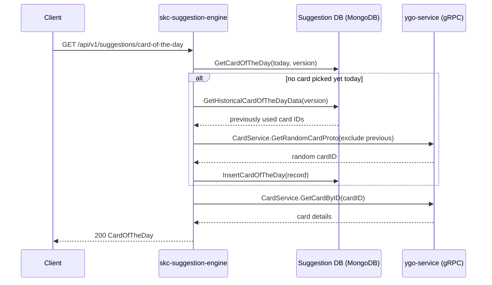

### `GET /api/v1/suggestions/card/{cardID}`

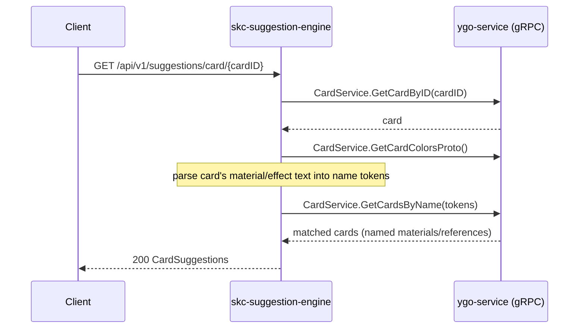

### `POST /api/v1/suggestions/card`

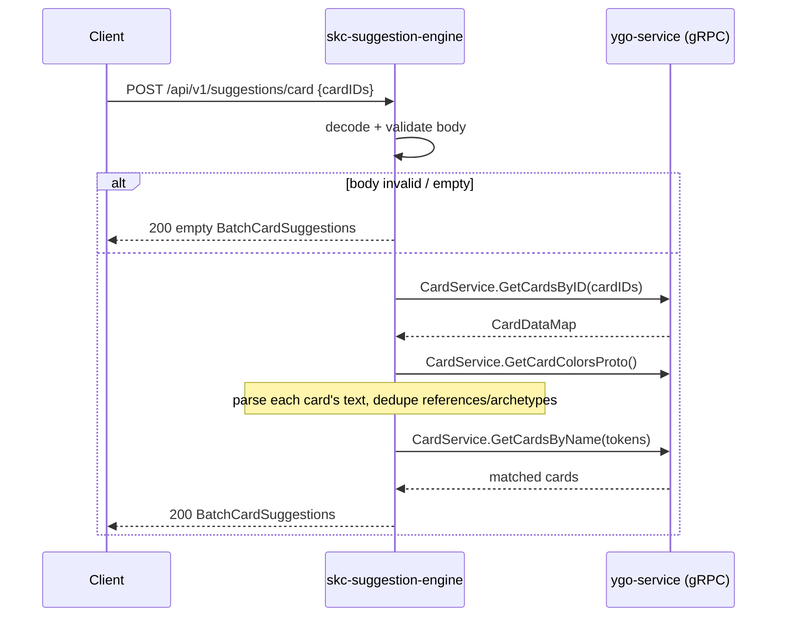

### `GET /api/v1/suggestions/card/support/{cardID}`

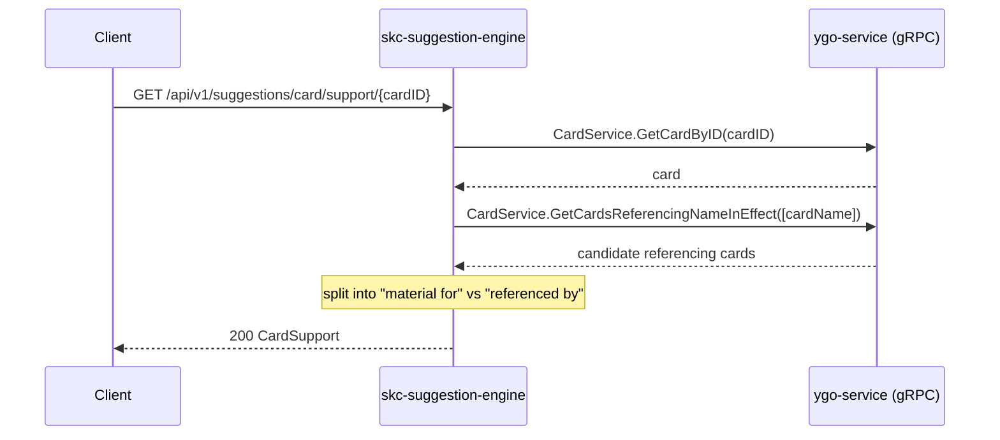

### `POST /api/v1/suggestions/card/support`

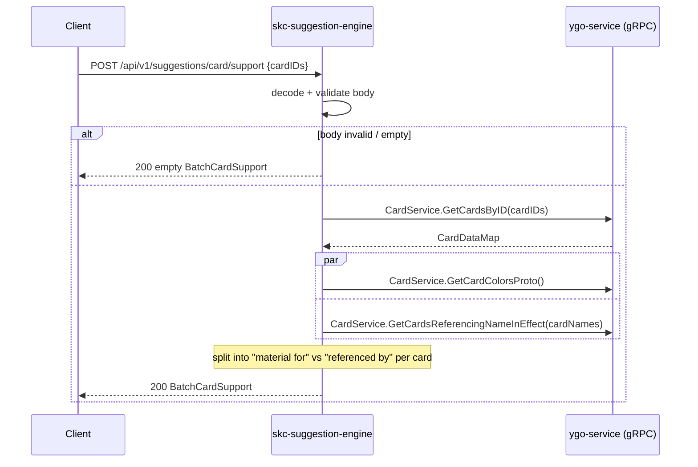

### `GET /api/v1/suggestions/card/{cardID}/similar`

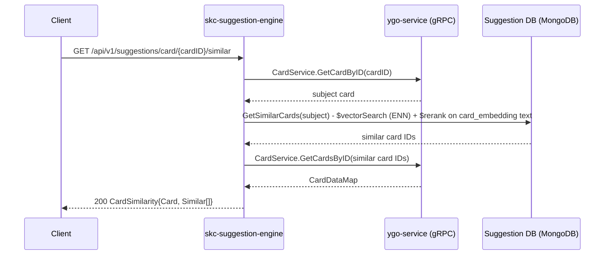

### `GET /api/v1/suggestions/product/{productID}`

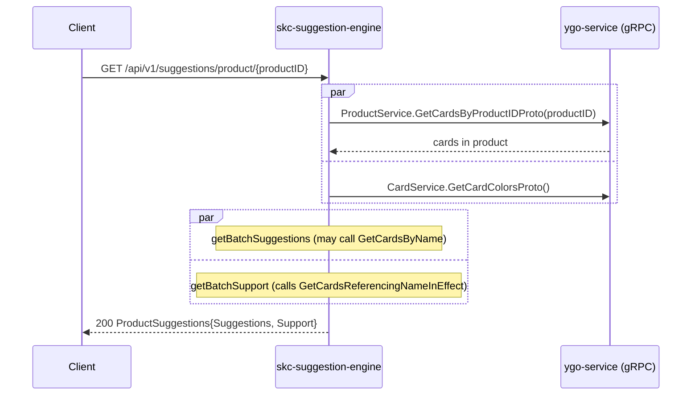

### `GET /api/v1/suggestions/archetype/{archetypeName}`

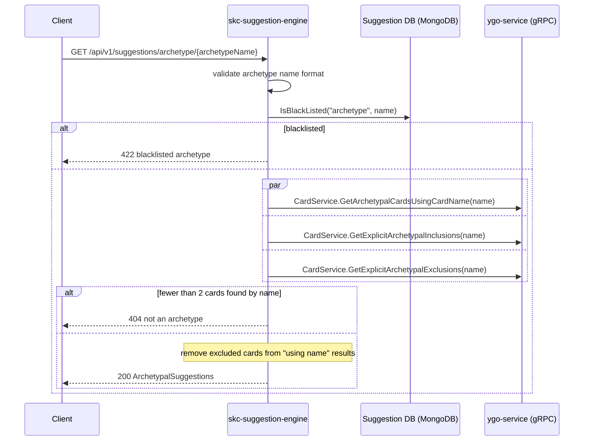

### `GET /api/v1/suggestions/trending/{resource}`

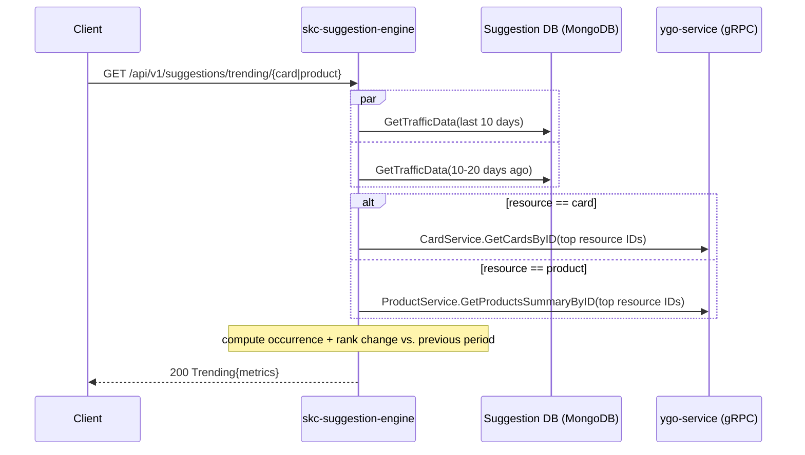

### `POST /api/v1/suggestions/traffic-analysis` 🔒 (requires `API-Key` header)

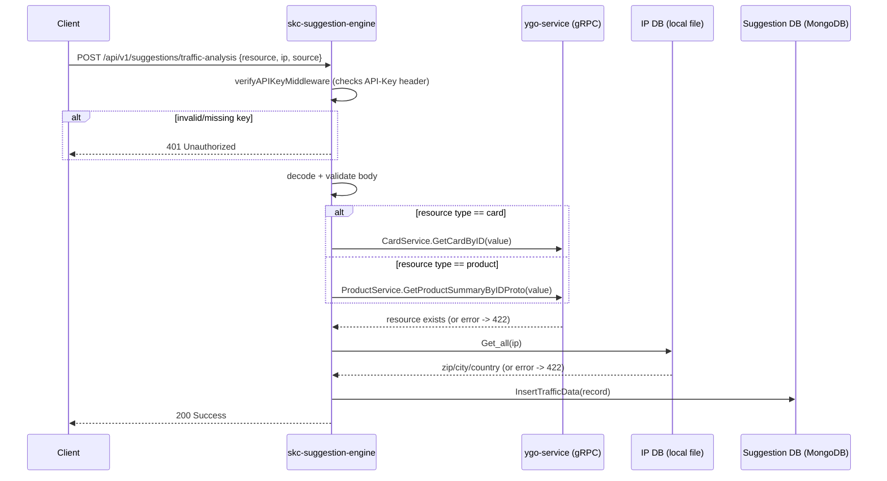
