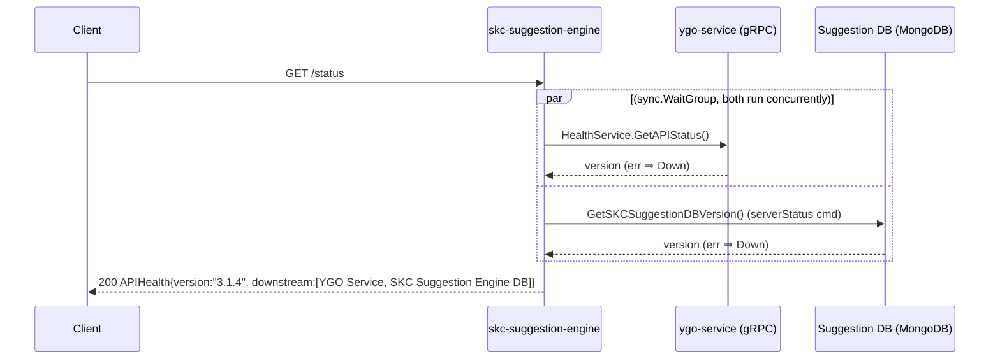
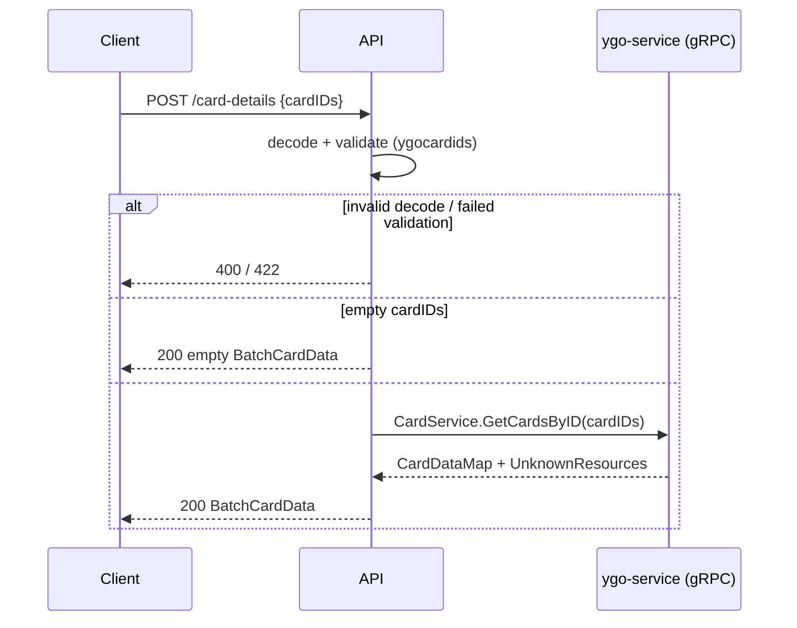
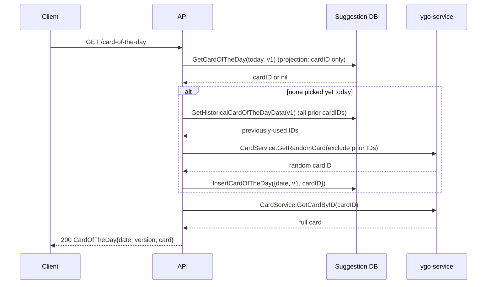
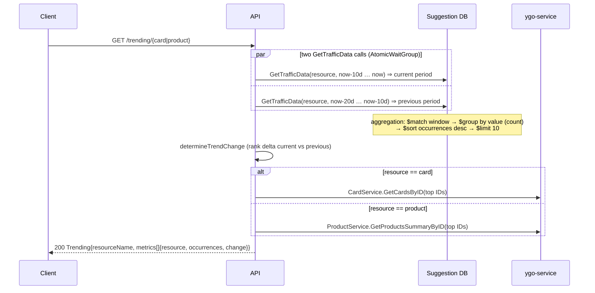
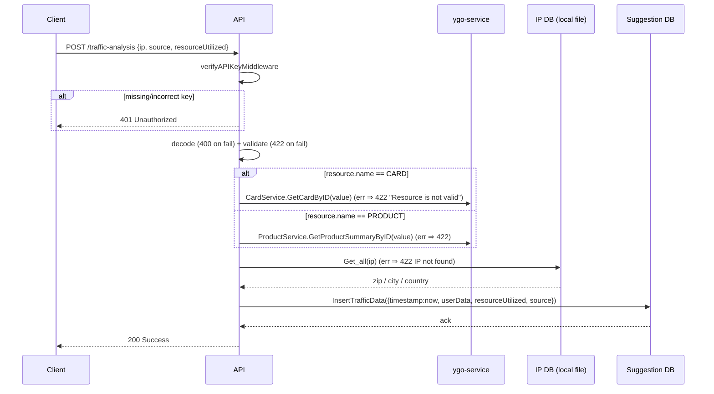

# System Design

This document describes the runtime behavior of **skc-suggestion-engine** in depth: the
cross-cutting infrastructure every request passes through, the shared data model, and a
per-endpoint breakdown covering the request/response contract, validation, status codes, the
downstream calls (`ygo-service` via gRPC, `Suggestion DB` via MongoDB, `Voyage AI` via HTTPS, and
the local IP DB file), and the algorithm each handler runs.

Diagrams reflect what each handler actually does. When you change a handler, update the matching
section here — the numeric parameters (pipeline limits, rerank `topK`, boost weights, timeouts) are
part of the contract this doc pins down.

---

## 1. Architecture at a glance

```
                       ┌────────────────────────────────────────────────┐
   HTTPS (TLS 1.3/h2)  │  skc-suggestion-engine (chi router, :9000)      │
   ───────────────────▶│                                                 │
                       │  api/         handlers + middleware             │
                       │  suggest/     text-parsing / ranking business   │
                       │  db/          Mongo DAO (interface-backed)      │
                       │  downstream/  ygo-service (gRPC) + Voyage (HTTP) │
                       │  validation/  request payload validation        │
                       │  model/       request/response/persistence types│
                       └───────┬─────────────────┬──────────────┬────────┘
                               │ gRPC            │ HTTPS        │ Mongo wire (X.509)
                               ▼                 ▼              ▼
                        ygo-service         Voyage AI      Suggestion DB (Atlas)
                     (cards/products/     (embeddings +   suggestionDB:
                      colors/archetypes)   rerank)         blackList, trafficAnalysis,
                               │                           cardOfTheDay, archetype,
                               ▼                           cardEmbedding
                        local IP DB file
                        (ip2location, traffic only)
```

Process startup (`main.go`): `downstream.ConnectToYGOService()` → `db.EstablishSKCSuggestionEngineDBConn()`
→ `go api.RunHttpServer()` → `select {}` (block forever). Env is loaded in `init()` unless
`IS_CICD=true` or the binary name ends in `.test`.

---

## 2. Cross-cutting concerns

Every request is shaped by the following, configured in `api/server.go` unless noted.

### 2.1 Transport
- **HTTPS only.** TLS 1.3 minimum, ALPN `h2` (HTTP/2), curve preferences `X25519`, `P256`. Cert +
  CA bundle are concatenated at boot (`cUtil.CombineCerts("certs")`) and served from
  `certs/concatenated.crt` / `certs/private.key`.
- **Port** `9000`.
- **Server timeouts:** ReadHeader 2s, Read 6s, Write 4s, Idle 15s, MaxHeaderBytes 32 KiB.
- **HTTP/2 tuning:** MaxConcurrentStreams 100, MaxHandlers 25, per-stream/per-conn upload buffers capped.

### 2.2 Middleware chain (applied to all routes)
1. `decodedPathRoutingMiddleware` — overwrites chi's routing path with `req.URL.Path` so URL-encoded
   path variables (e.g. an archetype name with encoded characters) route on their decoded form.
2. `commonResponseMiddleware` — sets `Content-Type: application/json` and `Cache-Control: max-age=300`
   on every response, and transparently **gzip-compresses** responses when the client sends
   `Accept-Encoding: gzip`. Gzip writers are pooled (`sync.Pool`, compression level 2) to avoid
   per-request allocation; `Content-Length` is dropped when compressing.

### 2.3 Authentication
Only the admin route group requires auth. `verifyAPIKeyMiddleware` compares the `API-Key` request
header against `EnvMap["API_KEY"]`; mismatch/absence → **401** with an `APIError` body. Currently the
sole admin route is `POST /api/v1/suggestions/traffic-analysis`.

### 2.4 CORS
Allowlisted origins only: `localhost:3000`, `dev.` / `www.` / apex `thesupremekingscastle.com`.
Methods `GET`, `POST`, `OPTIONS`; all headers allowed.

### 2.5 Error & response model
- Downstream/DB/business layers return `*cModel.APIError{Message, StatusCode}`; handlers surface it
  via `err.HandleServerResponse(res)`, which writes the status code and JSON body.
- Request-validation failures return `**422** ValidationErrors{errors:[{field,hint}], totalErrors}`
  (`validation.HandleValidationErrors`), with human-readable hints from the universal-translator.
- Handlers deliberately **degrade to empty-but-valid `200` bodies** rather than erroring on empty /
  malformed-but-decodable batch inputs (see §5 batch endpoints).

### 2.6 Logging
Request-scoped structured logging (`log/slog`). Handlers call `cUtil.InitRequest(ctx, apiName, op, …)`
to obtain a logger + enriched context; deeper layers call `cUtil.RetrieveLogger(ctx)`. **Always pull
the logger from context in request paths** rather than using the global `slog`.

### 2.7 Concurrency primitives
Fan-out work uses one of three patterns:
- `cUtil.AtomicWaitGroup[T]` — a generic wait-group wrapper storing one typed result; used by
  `suggest.FetchMetadata`, `trending`, and batch-support color fetching.
- Raw `sync.WaitGroup` + goroutines — status handler, product handler.
- Buffered channels + `select` fan-in — archetype v1 handler (three concurrent `ygo-service` calls).

### 2.8 Persistence topology (`db/connect.go`)
One MongoDB Atlas cluster, authenticated with **MONGODB-X509** (`certs/skc-suggestion-engine-db.pem`),
pool 15–30, but **two logical client connections** because `$vectorSearch` requires `ReadConcern:
local`:
- **general connection** — `ReadConcern: Available` (eventually consistent). Backs collections
  `blackList`, `trafficAnalysis`, `cardOfTheDay`, `archetype`.
- **vector-search connection** — `ReadConcern: local`. Backs `cardEmbedding`.

Writes use `WriteConcern: majority`; reads/writes retry. Indexes and Atlas **Search** indexes are
created idempotently at boot:
- `blackList`: unique `(type, phrase)`.
- `archetype`: unique `archetype`; secondary indexes on `inheritMembers`, `qualifiedMembers`.
- `cardEmbedding`: a BM25 `search` index (`text_search`, on field `text`) and a `vectorSearch` index
  (`text_embedding`, on `textEmbedding`, 512-dim, `dotProduct`, HNSW maxEdges 25 / numEdgeCandidates 200).

Most DAO operations run under a **1s** context timeout; vector/similar searches use **2s**.

---

## 3. Shared data model

Response envelopes live in `model/`. Notable JSON quirks are called out because they surprise
consumers:

| Type | Purpose | Notable fields / quirks |
| --- | --- | --- |
| `CardReference` | A suggested/related card + how often it was referenced | `{occurrences, card}` |
| `CardSuggestions` | Single-card suggestion result | `hasSelfReference`, `namedMaterials`, `namedReferences`, `relevantArchetypes`, `materialArchetypes`, `referencedArchetypes` |
| `BatchCardSuggestions[RK]` | Batch/product suggestion result | `unknownResources`; **`IntersectingResources` serializes as `falsePositives`** |
| `CardSupport` / `BatchCardSupport[RK]` | Support-card result | `referencedBy`, `materialFor` (+ batch: `unknownResources`, `falsePositives`) |
| `ProductSuggestions[RK]` | Product result | `{suggestions, support}` |
| `ArchetypalSuggestions` | v1 archetype result | `total`, `usingName`, `usingText`, `exclusions` |
| `ArchetypeMembers` | v2 archetype result | `archetype`, `inheritMembers`, `qualifiedMembers`, `excludedMembers` |
| `SimilarCards` / `SemanticSearchResults` | Vector-search results | `{card|query, matches[]}` |
| `CardOfTheDay` | COTD result | `date`, `version`, `card`; **`CardID` is `json:"-"` (never serialized)** |
| `Trending` | Trending result | `resourceName`, `metrics[]{resource, occurrences, change}` |
| `VectorSearchResult` | Internal Mongo→rerank carrier | `{id, text}` only (scores computed in-pipeline are not decoded) |

`RK` is a generic resource-key type (`cModel.CardIDs` / `cModel.ProductIDs`).

### 3.1 Validation rules (`validation/`)
| Validator | Rule |
| --- | --- |
| `archetype` | `^.{3,}$` (≥3 chars; **case-sensitive** — `HERO` ≠ `Hero`) |
| `ygocardids` | every ID matches `^[0-9]{8}$` |
| `systemname` | `^[a-zA-Z0-9 \-]{3,}$` |
| `systemversion` | `^([1-9]\d*|0)(\.(([1-9]\d*)|0)){2,3}$` (3–4 dotted numeric components) |
| `trendingresource` | value is `CARD` or `PRODUCT` |
| `ipv4` | built-in validator |

Route-level regex guards (in the router) reject malformed IDs before the handler runs: `cardID`
`\d{8}`, `productID` `[0-9A-Z]{3,4}`, `resource` `(?i)card|product`.

---

## 4. Endpoints (v1) — `/api/v1/suggestions`

### `GET /status`

Health of the API and its two hard dependencies. Version string is currently hard-coded (`3.1.4`).


```mermaid
sequenceDiagram
    participant Client
    participant API as skc-suggestion-engine
    participant YGO as ygo-service (gRPC)
    participant DB as Suggestion DB (MongoDB)

    Client->>API: GET /status
    par (sync.WaitGroup, both run concurrently)
        API->>YGO: HealthService.GetAPIStatus()
        YGO-->>API: version (err ⇒ Down)
    and
        API->>DB: GetSKCSuggestionDBVersion()  (serverStatus cmd)
        DB-->>API: version (err ⇒ Down)
    end
    API-->>Client: 200 APIHealth{version:"3.1.4", downstream:[YGO Service, SKC Suggestion Engine DB]}
```

- Each dependency is probed independently; one being `Down` does **not** fail the request — the
  endpoint always returns `200` and reports per-dependency status so callers can isolate outages.

---

### `POST /card-details`

Batch card hydration — no suggestion logic, just id → card data.

- **Request:** `BatchCardIDs{cardIDs:[…8-digit…]}`. **Response:** `BatchCardData{cardInfo, unknownResources}`.
- **Validation:** body must decode (else **400**) and pass `ygocardids` (else **422**).
- Empty/absent `cardIDs` short-circuits to a **200** empty `BatchCardData`.


```mermaid
sequenceDiagram
    participant Client
    participant API
    participant YGO as ygo-service (gRPC)

    Client->>API: POST /card-details {cardIDs}
    API->>API: decode + validate (ygocardids)
    alt invalid decode / failed validation
        API-->>Client: 400 / 422
    else empty cardIDs
        API-->>Client: 200 empty BatchCardData
    else
        API->>YGO: CardService.GetCardsByID(cardIDs)
        YGO-->>API: CardDataMap + UnknownResources
        API-->>Client: 200 BatchCardData
    end
```

---

### `GET /card-of-the-day`

One card is chosen per calendar day (**America/Chicago**) and cached in `cardOfTheDay`. `version` is
fixed at `1`.


```mermaid
sequenceDiagram
    participant Client
    participant API
    participant DB as Suggestion DB
    participant YGO as ygo-service

    Client->>API: GET /card-of-the-day
    API->>DB: GetCardOfTheDay(today, v1)   (projection: cardID only)
    DB-->>API: cardID or nil
    alt none picked yet today
        API->>DB: GetHistoricalCardOfTheDayData(v1)  (all prior cardIDs)
        DB-->>API: previously-used IDs
        API->>YGO: CardService.GetRandomCard(exclude prior IDs)
        YGO-->>API: random cardID
        API->>DB: InsertCardOfTheDay({date, v1, cardID})
    end
    API->>YGO: CardService.GetCardByID(cardID)
    YGO-->>API: full card
    API-->>Client: 200 CardOfTheDay{date, version, card}
```

- Selection excludes every previously-featured card (historical dedupe), so COTD does not repeat.
- Any failure inside the "pick + persist" path returns a generic **500**.

---

### `GET /card/{cardID:\d{8}}` — single-card suggestions

Suggests cards **explicitly named** in the subject's material clause / effect text, plus the
archetypes it references.

```mermaid
sequenceDiagram
    participant Client
    participant API
    participant YGO as ygo-service
    participant DB as Suggestion DB

    Client->>API: GET /card/{cardID}
    API->>YGO: CardService.GetCardByID(cardID)
    YGO-->>API: subject card
    par suggest.FetchMetadata (concurrent)
        API->>YGO: CardService.GetCardColors()
        YGO-->>API: card-color → sort-rank map
    and
        API->>DB: GetRelevantArchetypes([cardID])
        DB-->>API: archetypes the card belongs to
    end
    Note over API: split effect into material-clause vs remaining-effect;<br/>regex-extract quoted tokens; partition into archetype tokens<br/>(seeded by relevantArchetypes) vs candidate card-name tokens
    API->>YGO: CardService.GetCardsByName(candidate tokens)
    YGO-->>API: matched cards
    Note over API: build NamedMaterials / NamedReferences with occurrence counts;<br/>sort; strip + flag self-reference
    API-->>Client: 200 CardSuggestions
```

**Algorithm detail** (`suggest` package + `getCardSuggestions`):
1. `QuotedStringRegex` extracts quoted substrings (≥3 chars) from the effect.
2. `GenerateUnparsedSuggestionData` cleans tokens and resolves them to real cards via one
   `GetCardsByName` batch call; `relevantArchetypes` seed an archetype set.
3. Material text (`GetPotentialMaterialsAsString`) is separated from the rest of the effect so tokens
   are attributed to `NamedMaterials` vs `NamedReferences`. Tokens matching an archetype go to
   `MaterialArchetypes` / `ReferencedArchetypes` instead.
4. Results are de-duplicated with **occurrence counts**, then sorted by `SortCardReferences`:
   **occurrences desc → card-color rank (from `GetCardColors`) → name asc**.
5. `RemoveSelfReference` drops the subject from its own references and sets `hasSelfReference`.

---

### `POST /card` — batch suggestions

Same logic as the single-card endpoint, run over many cards, with cross-card de-duplication.

```mermaid
sequenceDiagram
    participant Client
    participant API
    participant YGO as ygo-service
    participant DB as Suggestion DB

    Client->>API: POST /card {cardIDs}
    API->>API: decode + validate
    alt invalid / empty
        API-->>Client: 400 / 422 / 200 empty BatchCardSuggestions
    else
        API->>YGO: CardService.GetCardsByID(cardIDs)
        YGO-->>API: CardDataMap
        par suggest.FetchMetadata
            API->>YGO: CardService.GetCardColors()
        and
            API->>DB: GetRelevantArchetypes(cardIDs)
        end
        Note over API: concatenate all effects → ONE GetCardsByName call;<br/>parse per card; merge occurrences across the batch
        API->>YGO: CardService.GetCardsByName(all tokens)
        YGO-->>API: matched cards
        API-->>Client: 200 BatchCardSuggestions
    end
```

**Batch-specific behavior** (`getBatchSuggestions`):
- All subject effects are concatenated into one text blob so tokens are resolved with a **single**
  `GetCardsByName` call for the whole batch.
- References are merged across cards by card ID, **summing occurrences**.
- A suggested card that is itself one of the requested `cardIDs` is not emitted as a suggestion;
  instead its ID is recorded in `IntersectingResources` (JSON **`falsePositives`**).
- `unknownResources` carries requested IDs that `ygo-service` had no data for.

---

### `GET /card/support/{cardID:\d{8}}` — single-card support

Finds cards that support the subject: those that name it as a **summoning material** vs those that
merely **reference** it in effect text.

```mermaid
sequenceDiagram
    participant Client
    participant API
    participant YGO as ygo-service

    Client->>API: GET /card/support/{cardID}
    API->>YGO: CardService.GetCardByID(cardID)
    YGO-->>API: subject
    API->>YGO: CardService.GetCardsReferencingNameInEffect([subject name])
    YGO-->>API: candidate referencing cards
    Note over API: determineSupportCards — for each candidate:<br/>if name in material clause ⇒ MaterialFor (strip material text);<br/>if name in remaining effect ⇒ ReferencedBy (a card can be BOTH)
    API-->>Client: 200 CardSupport{referencedBy, materialFor}
```

- `determineSupportCards` skips self-matches (same name). A candidate can land in **both** buckets:
  material membership is checked first (and the material clause is stripped before the effect-body
  check). `Occurrences` is always `1` here.

---

### `POST /card/support` — batch support

```mermaid
sequenceDiagram
    participant Client
    participant API
    participant YGO as ygo-service

    Client->>API: POST /card/support {cardIDs}
    API->>API: decode + validate
    alt invalid / empty
        API-->>Client: 400 / 422 / 200 empty BatchCardSupport
    else
        API->>YGO: CardService.GetCardsByID(cardIDs)
        YGO-->>API: CardDataMap
        par (color fetch kicked off async when ccIDs not supplied)
            API->>YGO: CardService.GetCardColors()
        and
            API->>YGO: CardService.GetCardsReferencingNameInEffect(all names)
        end
        Note over API: determineSupportCards per requested card;<br/>merge referencedBy / materialFor across batch (sum occurrences);<br/>record requested-set members as falsePositives
        API-->>Client: 200 BatchCardSupport
    end
```

- `getBatchSupport(ctx, cards, ccIDs)` fetches card colors **concurrently** only when `ccIDs == nil`
  (the standalone endpoint passes `nil`; the product endpoint passes colors it already fetched).
- De-dupe / occurrence-merge / `falsePositives` handling mirror the batch-suggestion endpoint.

---

### `GET /card/{cardID:\d{8}}/similar` — similar cards (vector + text search)

Anchored on a **subject card**: embed its effect, run hybrid retrieval over `cardEmbedding`, apply
metadata boosts, rerank, hydrate. See §6 for the ranking math.

```mermaid
sequenceDiagram
    participant Client
    participant API
    participant YGO as ygo-service
    participant Voyage as Voyage AI
    participant DB as Suggestion DB

    Client->>API: GET /card/{cardID}/similar
    API->>YGO: CardService.GetCardByID(cardID)
    YGO-->>API: subject card
    API->>Voyage: EmbedText(subject effect, input_type=query)  [voyage-4, 512-dim]
    Voyage-->>API: query embedding
    API->>DB: SearchSimilarCards(subject, embedding)   (2s timeout)
    Note over API,DB: $rankFusion (RRF k=60): vectorPipeline $vectorSearch<br/>(numCandidates 600, limit 60, filter id ≠ subject) ⊕ textPipeline $search<br/>(BM25 on `text`, id ≠ subject, limit 60); weights 0.65 / 0.35.<br/>Then metadata boosts (shared type/attribute/monster type),<br/>$sort finalScore desc, $limit 30.
    DB-->>API: ≤30 candidates {id, text}
    API->>Voyage: RerankVectorResults(candidate texts, subject effect, topK=20)  [rerank-2.5]
    Voyage-->>API: reranked order
    API->>YGO: CardService.GetCardsByID(reranked IDs)
    YGO-->>API: CardDataMap
    API-->>Client: 200 SimilarCards{card, matches[]}   (matches preserve rerank order)
```

- The subject card is excluded from both retrieval pipelines.
- `rerankAndHydrateCards` maps Voyage's returned indices back onto the candidate list, then hydrates
  in rerank order (IDs with no `ygo-service` data are logged and skipped).

---

### `GET /card/search?q={query}` — free-text semantic search

Anchored on the **caller's query string** (no subject card ⇒ no metadata boosts). Same hybrid
retrieval pipeline shape as `/similar`, but different rerank depth.

```mermaid
sequenceDiagram
    participant Client
    participant API
    participant Voyage as Voyage AI
    participant DB as Suggestion DB
    participant YGO as ygo-service

    Client->>API: GET /card/search?q={query}
    API->>API: trim q
    alt q empty
        API-->>Client: 400 "Query parameter 'q' is required."
    else
        API->>Voyage: EmbedText(q, input_type=query)  [voyage-4, 512-dim]
        Voyage-->>API: query embedding
        API->>DB: SemanticKeywordSearch(q, embedding)   (2s timeout)
        Note over API,DB: $rankFusion (RRF k=60): $vectorSearch (numCandidates 600, limit 60)<br/>⊕ $search (BM25, limit 60); weights 0.65 / 0.35;<br/>NO metadata boosts, NO subject exclusion; $limit 30.
        DB-->>API: ≤30 candidates {id, text}
        API->>Voyage: RerankVectorResults(candidate texts, q, topK=10)  [rerank-2.5]
        Voyage-->>API: reranked order
        API->>YGO: CardService.GetCardsByID(reranked IDs)
        YGO-->>API: CardDataMap
        API-->>Client: 200 SemanticSearchResults{query, matches[]}
    end
```

> **Corrected from prior revisions:** `search` shares `vectorSearchCandidateLimit = 30` with
> `/similar`, so its retrieval is **numCandidates 600 / per-pipeline limit 60 / top 30** (not
> 200/20/10), and its rerank `topK` is **10** (not 20). The only intentional differences vs `/similar`
> are: no metadata boosts, no subject exclusion, no post-fusion re-sort, and `topK=10`.

---

### `GET /product/{productID:[0-9A-Z]{3,4}}` — product suggestions

Union of batch **suggestions** and batch **support** over every card in a product.

```mermaid
sequenceDiagram
    participant Client
    participant API
    participant YGO as ygo-service
    participant DB as Suggestion DB

    Client->>API: GET /product/{productID}
    API->>YGO: ProductService.GetCardsByProductID(productID)
    YGO-->>API: cards in product
    par suggest.FetchMetadata (over product's cardIDs)
        API->>YGO: CardService.GetCardColors()
    and
        API->>DB: GetRelevantArchetypes(cardIDs)
    end
    par (sync.WaitGroup, 2 branches concurrent)
        Note over API: getBatchSuggestions (may call GetCardsByName)
    and
        Note over API: getBatchSupport (calls GetCardsReferencingNameInEffect;<br/>reuses colors, so no extra GetCardColors call)
    end
    API-->>Client: 200 ProductSuggestions{suggestions, support}
```

- `loadPSData` fetches product contents + metadata once; the suggestion and support computations then
  run concurrently, both reusing the pre-fetched `ccIDs` (color map).

---

### `GET /archetype/{archetypeName}` (v1) — derived archetype membership

Membership is **derived** by asking `ygo-service` to match cards by name/text; there is no curated
membership source. Blacklisted (common English) words are rejected.

```mermaid
sequenceDiagram
    participant Client
    participant API
    participant DB as Suggestion DB
    participant YGO as ygo-service

    Client->>API: GET /archetype/{archetypeName}
    API->>API: validate archetype (≥3 chars)
    API->>DB: IsBlackListed("archetype", name)   (sanitized, ≤40 chars)
    alt blacklisted
        API-->>Client: 422 blacklisted archetype
    else
        par three concurrent ygo-service calls (buffered channels + select fan-in)
            API->>YGO: GetArchetypalCardsUsingCardName(name)     ⇒ UsingName
        and
            API->>YGO: GetExplicitArchetypalInclusions(name)     ⇒ UsingText
        and
            API->>YGO: GetExplicitArchetypalExclusions(name)     ⇒ Exclusions
        end
        alt UsingName has < 2 cards
            API-->>Client: 404 "likely not an archetype"
        else
            Note over API: removeExclusions — drop excluded names from UsingName;<br/>Total = len(UsingName) + len(UsingText)
            API-->>Client: 200 ArchetypalSuggestions{total, usingName, usingText, exclusions}
        end
    end
```

- The "< 2 cards by name ⇒ 404" heuristic guards against arbitrary strings being treated as archetypes.
- `IsBlackListed` sanitizes input (trim + strip control chars) and rejects phrases > 40 chars at the DB layer.

---

### `GET /trending/{resource:(?i)card|product}` — trending resources

Compares resource utilization in the **last 10 days** against the **prior 10-day window** and reports
rank movement.


```mermaid
sequenceDiagram
    participant Client
    participant API
    participant DB as Suggestion DB
    participant YGO as ygo-service

    Client->>API: GET /trending/{card|product}
    par two GetTrafficData calls (AtomicWaitGroup)
        API->>DB: GetTrafficData(resource, now-10d … now)     ⇒ current period
    and
        API->>DB: GetTrafficData(resource, now-20d … now-10d) ⇒ previous period
    end
    Note over DB: aggregation: $match window → $group by value (count)<br/>→ $sort occurrences desc → $limit 10
    API->>API: determineTrendChange (rank delta current vs previous)
    alt resource == card
        API->>YGO: CardService.GetCardsByID(top IDs)
    else resource == product
        API->>YGO: ProductService.GetProductsSummaryByID(top IDs)
    end
    API-->>Client: 200 Trending{resourceName, metrics[]{resource, occurrences, change}}
```

- Each period returns the **top 10** resources by occurrence. `change` = previous-rank − current-rank
  when the resource appeared last period; otherwise it is treated as a new entrant
  (`change = totalElements − currentPosition`, i.e. a positive climb).
- Resource hydration is generic over card vs product (`fetchResourceInfo[…]`) and runs concurrently
  with trend computation.

---

### `POST /traffic-analysis` 🔒 — ingest traffic (requires `API-Key`)

The only write endpoint exposed to clients, and the only one behind the API-key middleware.


```mermaid
sequenceDiagram
    participant Client
    participant API
    participant YGO as ygo-service
    participant IPDB as IP DB (local file)
    participant DB as Suggestion DB

    Client->>API: POST /traffic-analysis {ip, source, resourceUtilized}
    API->>API: verifyAPIKeyMiddleware
    alt missing/incorrect key
        API-->>Client: 401 Unauthorized
    end
    API->>API: decode (400 on fail) + validate (422 on fail)
    alt resource.name == CARD
        API->>YGO: CardService.GetCardByID(value)      (err ⇒ 422 "Resource is not valid")
    else resource.name == PRODUCT
        API->>YGO: ProductService.GetProductSummaryByID(value)  (err ⇒ 422)
    end
    API->>IPDB: Get_all(ip)                              (err ⇒ 422 IP not found)
    IPDB-->>API: zip / city / country
    API->>DB: InsertTrafficData({timestamp:now, userData, resourceUtilized, source})
    DB-->>API: ack
    API-->>Client: 200 Success
```

- **Request** `TrafficData{ip (ipv4), source{systemName, version}, resourceUtilized{name, value}}`.
  Validation enforces `ipv4`, `systemname`, `systemversion`, `trendingresource`, and required fields.
- The resource is verified to actually exist downstream before storage, and the IP must resolve in the
  local ip2location DB — either failing yields **422** (nothing is stored).
- Persisted `timestamp` is `time.Now()` (server local/UTC), independent of the Chicago-based COTD date.

---

## 5. Batch-endpoint conventions

The three batch endpoints (`POST /card-details`, `POST /card`, `POST /card/support`) share one input
path (`parseBatchRequestBody`):
- **Decode failure → 400** (`"Body could not be deserialized"`).
- **Validation failure → 422** (`ygocardids`).
- **Empty/absent `cardIDs`** → the handler returns a **fully-formed, empty `200` body** of the correct
  shape (all slices non-nil) rather than an error — clients can always rely on the response schema.

`falsePositives` (`IntersectingResources`) in batch/product results are suggested cards that were
themselves part of the request — surfaced separately instead of as suggestions.

---

## 6. Vector search internals (`db/mongo_pipeline.go`, `db/skc_suggestion_engine_db.go`)

Both search endpoints build the same `$rankFusion` stage via `rankFusionStage(query, vector, limit,
excludeID)` with `limit = vectorSearchCandidateLimit = 30`.

### 6.1 Retrieval — hybrid `$rankFusion`
Two input pipelines are fused by **Reciprocal Rank Fusion**:
`score = Σ weightᵢ · 1/(k + rankᵢ)`, with `k = rrfRankConstant = 60` (fixed by MongoDB).

| Pipeline | Source | Params |
| --- | --- | --- |
| `vectorPipeline` | `$vectorSearch` (ANN over `textEmbedding`) | `numCandidates = limit·2·10 = 600`, `limit = limit·2 = 60`, `exact:false`; optional `filter id ≠ excludeID` |
| `textPipeline` | `$search` (BM25 over `text`) | `$limit = 60`; optional `$match id ≠ excludeID` |

Fusion weights: **vector 0.65 / text 0.35** (`vectorPipelineWeight` / `textPipelineWeight`).

`k = 60` is the well-worn RRF middle ground: small `k` makes a single pipeline's #1 dominate
(dominance); large `k` lets cross-pipeline agreement win (consensus). See the extended comment on
`rrfRankConstant` in `db/skc_suggestion_engine_db.go`.

### 6.2 Metadata boosts (`/similar` only)
`SearchSimilarCards` adds small additive boosts scaled to the max attainable fusion score
(`maxFusionScore = (0.65 + 0.35)/(60 + 1) ≈ 0.0164`), so boosts nudge rather than dominate:

| Shared attribute vs subject | Boost |
| --- | --- |
| card type | `0.03 · maxFusionScore` (≈ 4.9e-4) |
| attribute | `0.05 · maxFusionScore` (≈ 8.2e-4) |
| monster type | `0.08 · maxFusionScore` (≈ 1.3e-3) |

`finalScore = fusionScore + Σ boosts`, then `$sort finalScore desc`, `$limit 30`. `SemanticKeywordSearch`
has **no** boosts and no re-sort — it keeps the fusion order and just `$limit 30`.

### 6.3 Rerank + hydrate (`api/card_similarity_handler.go`)
Both endpoints share `rerankAndHydrateCards`:
1. Fetch ≤30 `VectorSearchResult{id, text}` from Mongo.
2. `RerankVectorResults(texts, query, topK)` via Voyage `rerank-2.5` — `topK = 20` for `/similar`,
   `topK = 10` for `search`. Returned indices are mapped back to the candidate list to reorder it.
3. `GetCardsByID(reranked IDs)` hydrates full card data; results are emitted **in rerank order**, and
   any ID `ygo-service` can't resolve is logged (`unknown_card_ids`) and skipped.

Embeddings: Voyage `voyage-4`, `output_dimension = 512`, `input_type = query` (the stored corpus was
embedded as `document`). Voyage calls go through a dedicated `http.Client` (10s timeout, HTTP/2
preferred) and are validated for expected result cardinality.

---

## 7. Endpoints (v2) — `/api/v2/suggestions`

### `GET /archetype/{archetypeName}` (v2) — curated archetype membership

Unlike v1 (which *derives* membership by scanning card names/text through `ygo-service`), v2 reads a
**curated membership document** straight from the `archetype` collection and hydrates it.

```mermaid
sequenceDiagram
    participant Client
    participant API
    participant DB as Suggestion DB
    participant YGO as ygo-service

    Client->>API: GET /api/v2/suggestions/archetype/{archetypeName}
    API->>API: validate archetype (≥3 chars)
    API->>DB: GetArchetypeMembers(name)
    alt document not found
        DB-->>API: 404 "Archetype does not exist"
    else
        DB-->>API: inheritMembers, qualifiedMembers, excludedMembers (ID lists)
        API->>YGO: CardService.GetCardsByID(inherit + qualified + excluded)
        YGO-->>API: CardDataMap
        Note over API: hydrate each list; sort each by card name
        API-->>Client: 200 ArchetypeMembers{archetype, inheritMembers, qualifiedMembers, excludedMembers}
    end
```

- The three membership lists are hydrated from a single `GetCardsByID` call and each sorted
  alphabetically by name. There is no blacklist check and no "< 2 cards" heuristic — membership is
  authoritative from the DB document.
